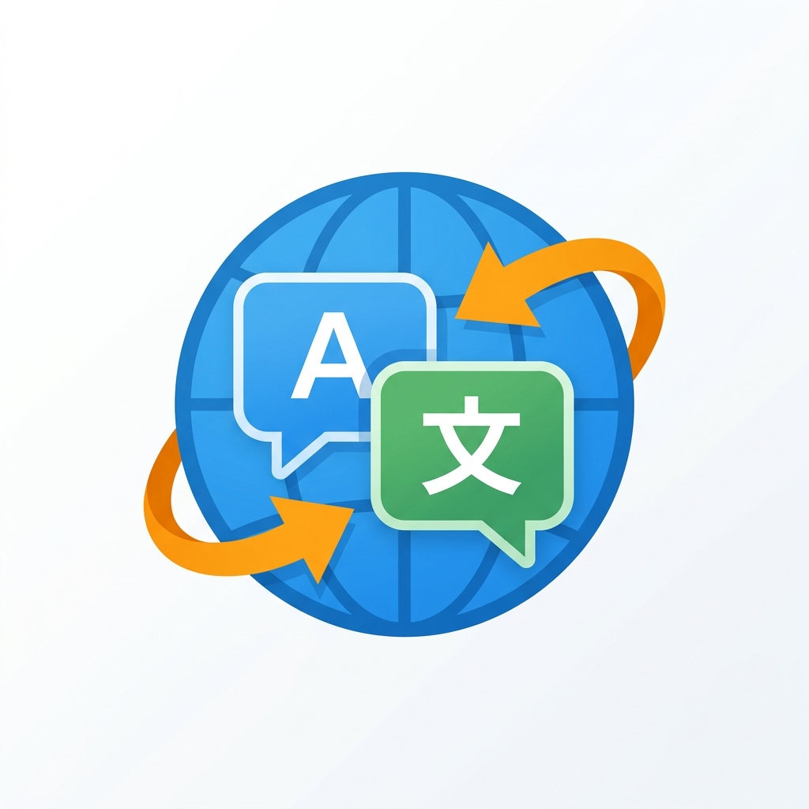

  
  
  # Universal Translator (Live Extension)
  **Tradução e legendas em tempo real para qualquer plataforma de streaming.**
  
  

---

O **Universal Translator** é uma extensão de navegador poderosa e leve que gera legendas traduzidas em tempo real para vídeos ao vivo e gravados. Funciona nativamente em plataformas como **Twitch**, **YouTube**, **Kick**, entre outras, sem interferir no código do site.

Perfeito para quem acompanha campeonatos internacionais de Esports, streamers estrangeiros ou criadores de conteúdo pelo mundo, quebrando a barreira do idioma instantaneamente.

## ✨ Principais Funcionalidades

- ⚡ **Ultra-Rápido (Deepgram API):** Utiliza o modelo Nova-2 da Deepgram, a tecnologia de conversão de voz em texto (Speech-to-Text) mais rápida e precisa do mercado.
- 🌍 **Tradução Universal:** Traduz de e para dezenas de idiomas com a confiabilidade do Google Translate.
- 🎮 **Modo Esports Especializado:** Otimizado para acompanhar a cadência insana das narrações de jogos (CS:GO, LoL, Valorant). Reduz o delay da legenda e "ensina" a IA a reconhecer gírias gamer como *clutch*, *ace*, *gank*, etc.
- 👑 **Reconhecimento de Voz (Diarization):** A IA entende quando mais de uma pessoa está falando, diferenciando o Streamer Principal (👑) de convidados/casters (🎤).
- 🎨 **Aparência 100% Personalizável:** Mude cores, tamanho da fonte, estilos de tipografia, sombras e muito mais, incluindo *Presets* nativos (Cinema, Neon, Minimalista).
- 🛡️ **Segurança e Privacidade:** A extensão não possui rastreadores e não armazena dados ou áudios. Todo processamento ocorre diretamente da aba do seu navegador para os servidores oficiais da API.

---

## 🚀 Como Instalar e Usar

1. **Clone este repositório** para a sua máquina (ou baixe o arquivo `.zip` e extraia).
2. Abra o Google Chrome (ou Edge/Brave) e acesse a página de extensões: `chrome://extensions/`
3. Ative o **"Modo do desenvolvedor"** (canto superior direito).
4. Clique em **"Carregar sem compactação"** e selecione a pasta onde você salvou a extensão.
5. Pronto! O ícone do Universal Translator aparecerá na sua barra de extensões.

### 🔑 Configurando sua API Key (Apenas na 1ª vez)
Para que a transcrição em tempo real funcione, você precisa de uma chave de API gratuita da Deepgram:
1. Acesse [console.deepgram.com](https://console.deepgram.com) e crie uma conta (é grátis e dá meses de crédito livre).
2. Vá no menu **API Keys** e crie uma nova chave.
3. Copie o código gerado, clique no ícone da nossa extensão e cole no campo **Deepgram API Key**.

---

## 🖥️ Dica de Ouro: Tela Cheia (Fullscreen)

Sempre que a extensão está capturando o áudio para gerar as legendas, o navegador Chrome bloqueia por segurança o modo "Fullscreen Nativo" dos sites. Ao clicar em tela cheia na Twitch ou YouTube, o vídeo apenas preencherá a janela, mas as abas e a barra do Windows continuarão visíveis.

**Para ter a experiência de Tela Cheia perfeita:**
1. Ligue a tradução na extensão.
2. Clique no botão de Fullscreen do vídeo (ele vai preencher a janela).
3. **Aperte a tecla `F11` do seu teclado!** O navegador inteiro ficará em tela cheia e esconderá tudo, e as legendas continuarão lá!

---

## 🛠️ Tecnologias Utilizadas

- **Manifest V3:** Arquitetura moderna, segura e exigida pelas lojas de extensões atuais.
- **Offscreen Documents & AudioWorklet:** O áudio é capturado e processado sem travar a interface da página e com zero delay.
- **WebSockets:** Comunicação contínua bidirecional com a IA para legendas sem atraso (Interim Results).
- **Vanilla JS, HTML5, CSS3:** Sem frameworks pesados para garantir o menor consumo de memória RAM possível do seu PC enquanto você joga ou assiste.

---

  
Feito com paixão pela comunidade. Desenvolvido por <a href="https://github.com/AngeLZinS2">AngeLZinS2</a>.

